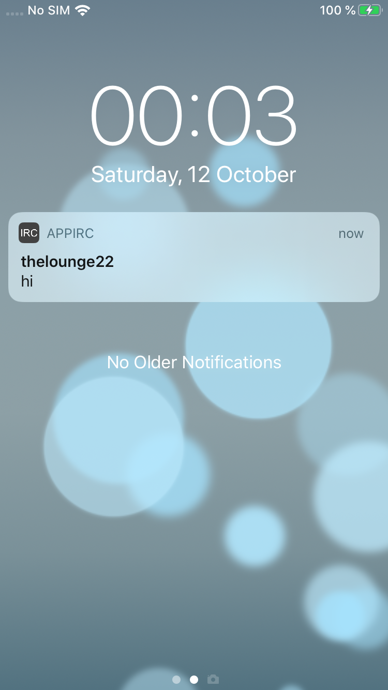
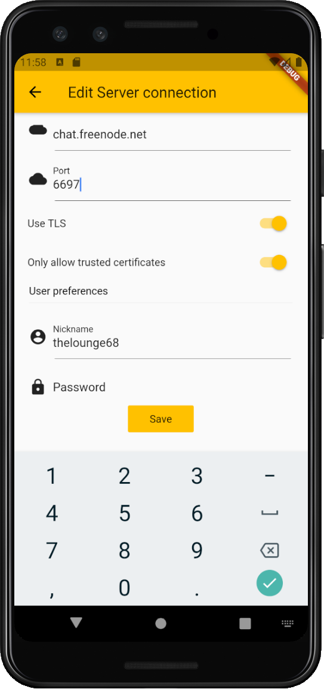
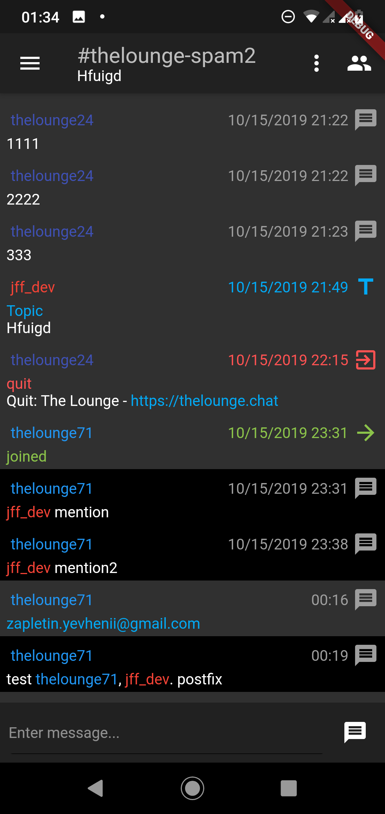

# AppIRC

* 7 march 2021 App (2.0.0) updated to support The Lounge 4.x. Currently app suppports The Lounge 3.x and The Lounge 4.x

Flutter (iOS/Android) mobile client for [TheLounge](https://thelounge.chat/). TheLounge is self-hosted IRC proxy and Web client:

* `Private` and `Public` 
* The Lounge 3.x or 4.x server support
* Works on `iOS 11+` `Android 5.0+`
* Native UI widgets for Android and iOS
* Push notifications support
* Day/Night theme support
* Search through messages support
* Upload files support





## Push notifications on mobile devices

The Lounge support web push notifications, which works (with some limitations) only on Android via PWA.

AppIRC support native push notifications on iOS and Android via FCM.
FCM push notifications designed for **private** mode. However **public** mode support FCM pushes too, only when socket.io connection is active.
To enable FCM notifications you should use custom The Lounge mode forks (see below).

# Build from source

- You should add android sign key info at `android/key.properties`
Example

```
storePassword=pass
keyPassword=pass
keyAlias=alias
storeFile=/path_to_key/key.jks
```

- If you want to use push notifications feature you should add FCM config files: `android/app/google-services.json` and `ios/Runner/GoogleService-Info.plist` from your FCM account. Lounge instance should use `serverKey` from same account. Also, it is required to setup iOS APN key in this Firebase account to enable pushes on iOS.


## The Lounge FCM notifications fork

TheLounge fork with push notifications support:

* 3.x - [https://github.com/xal/thelounge/tree/xal/fcm_push](https://github.com/xal/thelounge/tree/xal/fcm_push)
* 4.x - [https://github.com/xal/thelounge/tree/xal/fcm_push_4_x](https://github.com/xal/thelounge/tree/xal/fcm_push_4_x)


You should add server FCM key in your `config.js`. For example:

```


			//   - `scope`: LDAP search scope. It is set to `"sub"` by default.
			scope: "sub",
		},
	},

	fcmPushEnabled: true,
	// push notifications for mobile devices
	fcmPush: {
		// FCM token to send pushes
		// Disabled by default
		// shoud be like serverToken: "AAAALxJhc0Q:APA91bFVC5YwqyFMcXW0ow.........."
		// Apple APNs keys should be added to related FCM project to enabled pushes on iOS
		// More about FCM and how to get key - https://firebase.google.com/docs/cloud-messaging/
		serverToken: "",
	},

	// ## Debugging settings

	// The `debug` object contains several settings to enable debugging in The
	// Lounge. Use them to learn more about an issue you are noticing but be aware
	// this may produce more logging or may affect connection performance so it is
	// not recommended to use them by default.
	//
	// All values in the `debug` object are set to `false`.
	debug: {

```


## The Lounge Sign up fork

AppIRC support registration on private The Lounge instances from fork:

* 3.x - [https://github.com/xal/thelounge/tree/xal/sign_up](https://github.com/xal/thelounge/tree/xal/sign_up)
* 4.x - [https://github.com/xal/thelounge/tree/xal/sign_up_4_x](https://github.com/xal/thelounge/tree/xal/sign_up_4_x)

Don't forget to update your `config.js` file

```
	// This value is set to `false` by default.
	public: false,

	// Allow to signup when a server is private
	// It has no effect when server is public
	//
	// @type 		boolean
	// @default false
	signUp: true,
```

## FCM push + Sign up fork

The lounge FCM push and sign up fork:

* 3.x [https://github.com/xal/thelounge/tree/xal/sign_up_and_fcm_push](https://github.com/xal/thelounge/tree/xal/sign_up_and_fcm_push) 
* 4.x [https://github.com/xal/thelounge/tree/xal/sign_up_and_fcm_push_4_x](https://github.com/xal/thelounge/tree/xal/sign_up_and_fcm_push_4_x) 

